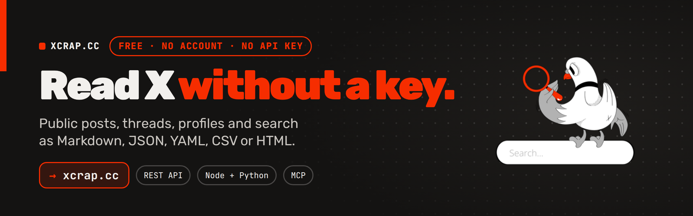
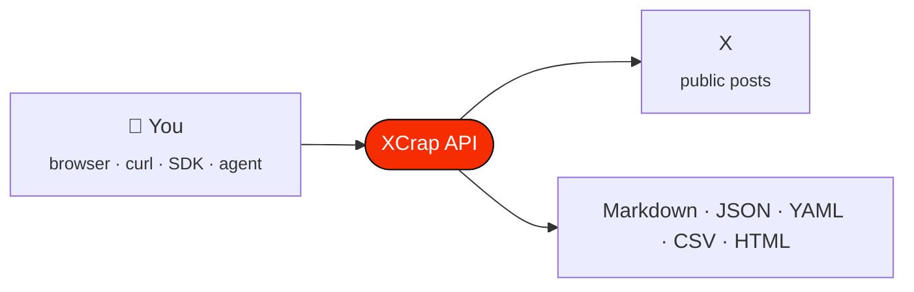

<p align="center">
  <a href="https://xcrap.cc"></a>
</p>

<p align="center">
  <a href="https://xcrap.cc"></a>
  <a href="https://xcrap.cc/docs"></a>
  
  <a href="https://www.npmjs.com/package/@xcrapcc/sdk"></a>
  <a href="https://pypi.org/project/xcrap-sdk/"></a>
  <a href="https://www.npmjs.com/package/@xcrapcc/mcp"></a>
</p>

<p align="center">
  <b>Read X (Twitter) without an API key.</b><br>
  Paste any public post, thread or profile and get it back as clean Markdown or JSON.<br>
  <sub>No account · no key · nothing to pay</sub>
</p>

---

## ⚡ Try it

```bash
curl 'https://xcrap.cc/v1/tweet?url=https://x.com/jack/status/20&format=markdown'
```

> [!TIP]
> In the browser, swap <kbd>x.com</kbd> for <kbd>xcrap.cc</kbd> in any post link.

## 🧭 How it works



## 🧰 Use it your way

| | Way in | Get started |
| --- | --- | --- |
| 🌐 | **In the browser** | Swap `x.com` for `xcrap.cc` in any post link |
| 🔌 | **curl / REST** | [API reference](https://xcrap.cc/docs) · [OpenAPI 3.1](https://xcrap.cc/openapi.json) |
| 🟩 | **Node.js** | `npm install @xcrapcc/sdk` · [xcrap-node](https://github.com/XcrapCC/xcrap-node) |
| 🐍 | **Python** | `pip install xcrap-sdk` · [xcrap-python](https://github.com/XcrapCC/xcrap-python) |
| 🤖 | **AI agents (MCP)** | Hosted: `https://xcrap.cc/mcp` · local: `npx -y @xcrapcc/mcp` · [Xcrap-mcp](https://github.com/XcrapCC/Xcrap-mcp) |
| 📖 | **Docs** | [xcrap-docs](https://github.com/XcrapCC/xcrap-docs) · [llms.txt](https://xcrap.cc/llms.txt) · [skills.md](https://xcrap.cc/skills.md) |

> [!NOTE]
> The SDKs and the MCP server are updated with every API change, so they always match what the API returns.

## 📚 What it reads

| 📄 Posts | 🧵 Threads | 💬 Replies | 👤 Profiles | 📜 Timelines | 🗂️ Account history |
| :---: | :---: | :---: | :---: | :---: | :---: |
| **👥 Followers** | **➡️ Following** | **🔎 Search** | **🔥 Trends** | **🖼️ Media** | **📦 Bulk (50 at once)** |

## 🚫 What it will not do

- **Read anything private:** public accounts only.
- **Keep your data:** posts are cached for five days, media is never stored.
- **Charge you later:** there is no key, so there is nothing to bill.
- **Argue with an opt-out:** ask to be excluded and it happens the same day.

## 🏢 Need more?

The free API has per-IP rate limits. The [Enterprise plan](https://xcrap.cc/enterprise) offers higher limits, dedicated capacity, custom endpoints and formats, priority support, and invoices or agreements — same rules, public accounts only. Write to **[hello@xcrap.cc](mailto:hello@xcrap.cc)**.

---

<p align="center">
  <a href="https://xcrap.cc"><b>xcrap.cc</b></a> · <a href="https://xcrap.cc/docs">Docs</a> · <a href="https://xcrap.cc/donate">Donate</a><br>
  <sub>No ads, no investors. Donations keep the free API running. Not affiliated with X Corp.</sub>
</p>
